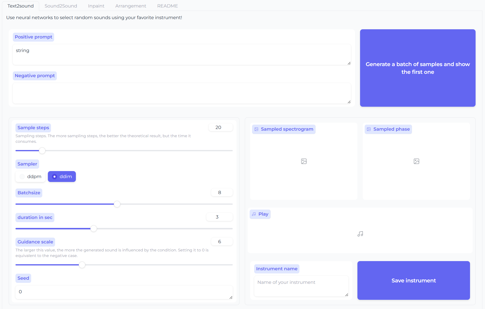
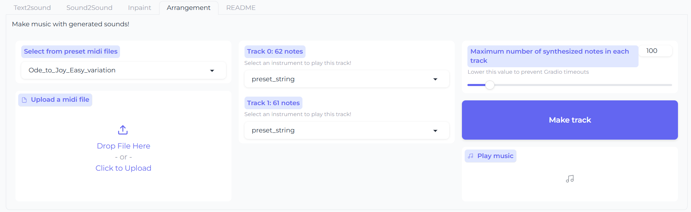

# Generation of Musical Timbres using a Text-Guided Diffusion Model

## Introduction

This codebase accompanies our [paper](arxiv link).

## Explore This Work with Hugging Face Space Web UI

We have created an interactive **Hugging Face Space Web UI** where you can:
- Generate new timbres base on text descriptions;
- Modify generated or uploaded timbres;
- Create sound tracks using generated/uploaded/modified timbres and MIDI files.

Try it out here:  
[](https://huggingface.co/spaces/WeixuanYuan/DiffuSynthV0.2)




## Installation
All models have been trained on [Google Colab](https://colab.google/) using Jupyter notebooks located in the ```colab_notebooks``` directory.
If you want to run the code locally, it is recommended to set up a clean Conda environment:

```#/usr/bin/bash
 conda create -n diffusynth python=3.10
 conda activate diffusynth 
 pip install torch==2.1.0 torchvision==0.16.0 -f https://download.pytorch.org/whl/torch_stable.html
 pip install -r requirements.txt
```

### Download Preprocessed Data and Pretrained Weights

You can download the preprocessed data and pretrained weights from [here](https://huggingface.co/datasets/WeixuanYuan/diffusynth/tree/main).
Please arrange the downloaded files as follows:

### Basic structure of this repository
```bash
./changeit3d  
├── colab_notebooks           # Jupyter notebooks for model training
├── data                      # Place the downloaded preprocessed data here
├── models                    # Place the downloaded pretrained weights here
├── model                     # Code for model definition and training
├── webUI                     # Gradio web app
├── ...                    
app.py                      # Launches the web app
requirements.txt
```

